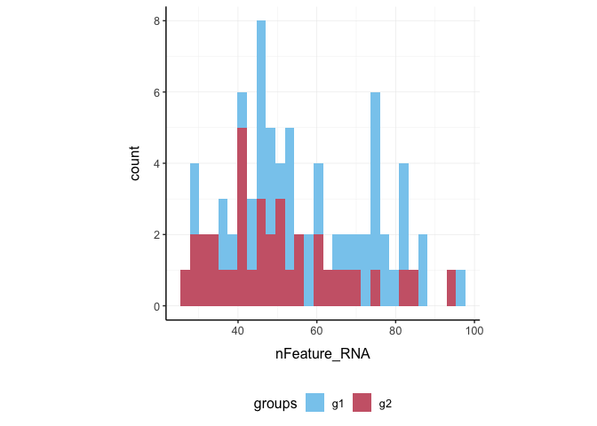

tidyseurat - part of tidyTranscriptomics
================

<!-- badges: start -->

[](https://www.tidyverse.org/lifecycle/#maturing)
[](https://github.com/stemangiola/tidyseurat/actions)
<!-- badges: end -->

**Brings Seurat to the tidyverse\!**

website:
[stemangiola.github.io/tidyseurat/](http://stemangiola.github.io/tidyseurat/)

Please have a look also to

  - [nanny](https://github.com/stemangiola/nanny) for tidy high-level
    data analysis and manipulation
  - [tidygate](https://github.com/stemangiola/tidygate) for adding
    custom gate information to your tibble
  - [tidyHeatmap](https://github.com/stemangiola/tidyHeatmap) for
    heatmaps produced with tidy principles

<!---

[](https://travis-ci.org/stemangiola/tidyseurat) [](https://coveralls.io/github/stemangiola/tidyseurat?branch=master)

-->

## Installation

From CRAN (in submission)

``` r
install.packages("tidyseurat")
```

From Github

``` r
devtools::install_github("stemangiola/tidyseurat")
```

## Create `tidyseurat`

This is a seurat object but it is evaluated as tibble. So it is fully
compatible both with Seurat and tidyverse APIs.

``` r
pbmc_small_tidy = tidyseurat::pbmc_small %>% tidy()
pbmc_small_tidy
```

    ## # A tibble: 80 x 15
    ##    cell  orig.ident nCount_RNA nFeature_RNA RNA_snn_res.0.8 letter.idents groups
    ##    <chr> <fct>           <dbl>        <int> <fct>           <fct>         <chr> 
    ##  1 ATGC… SeuratPro…         70           47 0               A             g2    
    ##  2 CATG… SeuratPro…         85           52 0               A             g1    
    ##  3 GAAC… SeuratPro…         87           50 1               B             g2    
    ##  4 TGAC… SeuratPro…        127           56 0               A             g2    
    ##  5 AGTC… SeuratPro…        173           53 0               A             g2    
    ##  6 TCTG… SeuratPro…         70           48 0               A             g1    
    ##  7 TGGT… SeuratPro…         64           36 0               A             g1    
    ##  8 GCAG… SeuratPro…         72           45 0               A             g1    
    ##  9 GATA… SeuratPro…         52           36 0               A             g1    
    ## 10 AATG… SeuratPro…        100           41 0               A             g1    
    ## # … with 70 more rows, and 8 more variables: RNA_snn_res.1 <fct>, PC_1 <dbl>,
    ## #   PC_2 <dbl>, PC_3 <dbl>, PC_4 <dbl>, PC_5 <dbl>, tSNE_1 <dbl>, tSNE_2 <dbl>

## Preliminary plots

We can treat `pbmc_small_tidy` effectively as a normal tibble.

Here we plot number of transcripts per cell

``` r
pbmc_small_tidy %>%
  tidyseurat::ggplot(aes(nFeature_RNA, fill=groups)) + 
  geom_histogram() +
  my_theme
```

<!-- -->

Here we plot total transcriptional material per cell

``` r
pbmc_small_tidy %>%
  tidyseurat::ggplot(aes(groups, nCount_RNA, fill=groups)) + 
  geom_boxplot(outlier.shape = NA) +
  geom_jitter(width = 0.1) +
  my_theme
```

<!-- -->

Here we plot abundance of two transcripts for each group

``` r
pbmc_small_tidy %>% 
  join_transcripts(transcripts = c("HLA-DRA" ,     "LYZ" )) %>%
  ggplot(aes(groups, abundance_RNA + 1, fill=groups)) + 
  geom_boxplot(outlier.shape = NA) + 
  geom_jitter(aes(size=nCount_RNA), alpha=0.5, width = 0.2) + 
  scale_y_log10() + 
  my_theme
```

<!-- -->

## Preprocess the dataset

Also you can treat the object as Seurat object and proceed with data
processing.

``` r
pbmc_small_pca = 
  pbmc_small_tidy %>%
  SCTransform(verbose = FALSE) %>% 
  FindVariableFeatures(verbose = FALSE) %>% 
  RunPCA(verbose = FALSE)

pbmc_small_pca
```

    ## # A tibble: 80 x 17
    ##    cell  orig.ident nCount_RNA nFeature_RNA RNA_snn_res.0.8 letter.idents groups
    ##    <chr> <fct>           <dbl>        <int> <fct>           <fct>         <chr> 
    ##  1 ATGC… SeuratPro…         70           47 0               A             g2    
    ##  2 CATG… SeuratPro…         85           52 0               A             g1    
    ##  3 GAAC… SeuratPro…         87           50 1               B             g2    
    ##  4 TGAC… SeuratPro…        127           56 0               A             g2    
    ##  5 AGTC… SeuratPro…        173           53 0               A             g2    
    ##  6 TCTG… SeuratPro…         70           48 0               A             g1    
    ##  7 TGGT… SeuratPro…         64           36 0               A             g1    
    ##  8 GCAG… SeuratPro…         72           45 0               A             g1    
    ##  9 GATA… SeuratPro…         52           36 0               A             g1    
    ## 10 AATG… SeuratPro…        100           41 0               A             g1    
    ## # … with 70 more rows, and 10 more variables: RNA_snn_res.1 <fct>,
    ## #   nCount_SCT <dbl>, nFeature_SCT <int>, PC_1 <dbl>, PC_2 <dbl>, PC_3 <dbl>,
    ## #   PC_4 <dbl>, PC_5 <dbl>, tSNE_1 <dbl>, tSNE_2 <dbl>

If a tool is not included in the tidyseurat collection, we can use
`as_tibble` to permanently convert `tidyseurat` into tibble

``` r
pbmc_small_pca %>%
  as_tibble %>%
  select(contains("PC"), everything()) %>%
      GGally::ggpairs(columns = 1:5, ggplot2::aes(colour=groups))
```

<!-- -->

## Identify clusters and reduce dimensions

We proceed with cluster identification

``` r
pbmc_small_cluster = 
  pbmc_small_pca %>%
  FindNeighbors(verbose=FALSE) %>% 
  FindClusters(method = "igraph", verbose=FALSE )

pbmc_small_cluster
```

    ## # A tibble: 80 x 19
    ##    cell  orig.ident nCount_RNA nFeature_RNA RNA_snn_res.0.8 letter.idents groups
    ##    <chr> <fct>           <dbl>        <int> <fct>           <fct>         <chr> 
    ##  1 ATGC… SeuratPro…         70           47 0               A             g2    
    ##  2 CATG… SeuratPro…         85           52 0               A             g1    
    ##  3 GAAC… SeuratPro…         87           50 1               B             g2    
    ##  4 TGAC… SeuratPro…        127           56 0               A             g2    
    ##  5 AGTC… SeuratPro…        173           53 0               A             g2    
    ##  6 TCTG… SeuratPro…         70           48 0               A             g1    
    ##  7 TGGT… SeuratPro…         64           36 0               A             g1    
    ##  8 GCAG… SeuratPro…         72           45 0               A             g1    
    ##  9 GATA… SeuratPro…         52           36 0               A             g1    
    ## 10 AATG… SeuratPro…        100           41 0               A             g1    
    ## # … with 70 more rows, and 12 more variables: RNA_snn_res.1 <fct>,
    ## #   nCount_SCT <dbl>, nFeature_SCT <int>, SCT_snn_res.0.8 <fct>,
    ## #   seurat_clusters <fct>, PC_1 <dbl>, PC_2 <dbl>, PC_3 <dbl>, PC_4 <dbl>,
    ## #   PC_5 <dbl>, tSNE_1 <dbl>, tSNE_2 <dbl>

Now we can interrogate the object as if it was a regular tibble data
frame

``` r
pbmc_small_cluster %>%
  tidyseurat::count(groups, seurat_clusters)
```

    ## # A tibble: 8 x 3
    ## # Groups:   groups [2]
    ##   groups seurat_clusters     n
    ##   <chr>  <fct>           <int>
    ## 1 g1     0                  17
    ## 2 g1     1                  14
    ## 3 g1     2                   9
    ## 4 g1     3                   4
    ## 5 g2     0                  13
    ## 6 g2     1                  12
    ## 7 g2     2                   6
    ## 8 g2     3                   5

## Reduce dimensions

We can calculate the first 3 UMAP dimensions using Seurat framework

``` r
pbmc_small_UMAP = 
  pbmc_small_cluster %>%
  RunUMAP(reduction = "pca", dims = 1:15, n.components = 3L, )
```

and we can plot them using 3D plot using plotly

``` r
pbmc_small_UMAP %>%
    plot_ly(
        x = ~`UMAP_1`,
        y = ~`UMAP_2`, 
        z = ~`UMAP_3`,
        color = ~ seurat_clusters
    ) 
```

<!--html_preserve-->

<div id="htmlwidget-c64457a584143ef1e822" class="plotly html-widget" style="width:672px;height:480px;">

</div>

<script type="application/json" data-for="htmlwidget-c64457a584143ef1e822">{"x":{"visdat":{"133d25efe0b6":["function () ","plotlyVisDat"]},"cur_data":"133d25efe0b6","attrs":{"133d25efe0b6":{"x":{},"y":{},"z":{},"color":{},"alpha_stroke":1,"sizes":[10,100],"spans":[1,20]}},"layout":{"margin":{"b":40,"l":60,"t":25,"r":10},"scene":{"xaxis":{"title":"UMAP_1"},"yaxis":{"title":"UMAP_2"},"zaxis":{"title":"UMAP_3"}},"hovermode":"closest","showlegend":true},"source":"A","config":{"showSendToCloud":false},"data":[{"x":[6.53173612952232,6.36876940131187,7.03650164008141,6.55522131323814,6.6794950902462,7.01866983771324,6.7821824491024,6.40633463263512,6.59762024283409,6.18055986762047,6.9664938390255,7.01296066641808,6.49511312842369,6.56305193305016,6.57743000388145,6.89375137686729,7.01308559775353,6.48464416861534,7.10751509070396,6.93657039999962,6.92854380011559,7.28502630591393,6.71771311163902,7.29223131537437,7.04746269583702,6.7464272916317,7.30604767203331,7.25595402121544,7.01022886633873,7.06775307059288],"y":[11.5283135354519,10.7085894525051,10.8671339929104,11.257818120718,10.5868786752224,11.038299459219,11.1493634164333,11.2481860101223,11.1395472466946,11.0592984139919,7.59875430464745,8.18448104262352,8.23392619490624,8.08994473814964,7.74761618971825,8.01899804472923,7.64437903761864,7.60362996459007,8.14712991118431,7.81488646864891,8.6157511651516,9.41175355315209,9.94269217848778,9.44877995848656,9.99967660307884,9.46758260130882,8.68599786162376,9.80573644042015,9.03281535506249,10.0702938020229],"z":[-5.56003659069538,-5.13579886257648,-5.25702565014362,-4.94951527416706,-5.18163292706013,-5.73782055675983,-6.02730362713337,-5.72730629742146,-5.29015534222126,-5.49146549999714,-6.50661270916462,-5.87316363155842,-6.49952547848225,-6.20535891354084,-6.28932850658894,-6.93289082348347,-6.86140053570271,-6.82902186214924,-6.71219961941242,-6.14218752682209,-6.22294466793537,-6.19121640026569,-5.78895991146564,-5.77883475124836,-5.54875557720661,-5.84484141170979,-5.94413988888264,-6.16199057400227,-5.94984810650349,-6.03364651501179],"type":"scatter3d","mode":"markers","name":"0","marker":{"color":"rgba(102,194,165,1)","line":{"color":"rgba(102,194,165,1)"}},"textfont":{"color":"rgba(102,194,165,1)"},"error_y":{"color":"rgba(102,194,165,1)"},"error_x":{"color":"rgba(102,194,165,1)"},"line":{"color":"rgba(102,194,165,1)"},"frame":null},{"x":[-9.57227254509926,-8.64794278740883,-9.61629796624184,-9.32994485497475,-9.60987020134926,-9.38935018181801,-9.16148973107338,-9.64048219323158,-8.96156621575355,-9.07710958123207,-9.40074754357338,-10.1616547167301,-9.37781739830971,-9.87877202630043,-9.98006177544594,-9.34374356865883,-9.97350335717201,-9.64729905724525,-9.69794488549232,-9.74219346642494,-8.47162461876869,-8.2341110765934,-7.86443448662758,-8.68385053277016,-8.44186139702797,-8.6944267809391],"y":[-6.23931418061256,-6.56876764893532,-7.08914480805397,-6.78720770478249,-6.66331587433815,-6.84464750885963,-6.41740999817848,-6.64174757599831,-6.97174654603004,-7.16103945374489,-6.80577765107155,-7.28446112275124,-7.09383974671364,-7.1702185690403,-6.76543055176735,-6.90914641022682,-7.07067404389381,-7.08411131501198,-6.80779562592506,-7.48406992554665,-5.09724579453468,-5.74595747590065,-5.51403103470802,-5.97120485901833,-5.50579605698586,-6.64153872132301],"z":[3.00410539805889,3.67709214389324,2.91037852466106,2.75606543719769,3.14085704982281,3.37742836177349,3.24494416415691,2.98054630458355,3.26856596171856,3.56985146701336,4.15854317843914,4.8109775274992,4.62381655871868,4.52742821872234,5.033973762393,4.91579062640667,5.14831406772137,5.30594832599163,4.91577441394329,4.90894705951214,2.82102329432964,2.96294004619122,2.52153880298138,2.80141813457012,2.47882635295391,2.7987590521574],"type":"scatter3d","mode":"markers","name":"1","marker":{"color":"rgba(252,141,98,1)","line":{"color":"rgba(252,141,98,1)"}},"textfont":{"color":"rgba(252,141,98,1)"},"error_y":{"color":"rgba(252,141,98,1)"},"error_x":{"color":"rgba(252,141,98,1)"},"line":{"color":"rgba(252,141,98,1)"},"frame":null},{"x":[-6.88667131066322,-7.07096791863441,-7.4671900331974,-7.19372678399086,-7.38110471367836,-7.6712276995182,-7.32879186272621,-7.07979798913002,-7.60068441033363,-7.40269399285316,-7.61055493950844,-7.86260057091713,-8.27942681908607,-8.05179906487465,-8.10963178277016],"y":[-3.00643311142921,-2.41199598908424,-3.10626183152199,-2.80095348954201,-2.58702717423439,-2.58593903183937,-3.19867096543312,-2.70369158387184,-2.94522057175636,-2.60775528550148,-5.18772946000099,-5.30893097519875,-4.58480797410011,-5.12688456177712,-5.18986807465553],"z":[3.94610411822796,3.61617333590984,3.70458132922649,4.24318558871746,3.37905080020428,3.69899518191814,4.09670693576336,3.78391987979412,4.18364436328411,4.10225732028484,2.61790830790997,2.92269904315472,2.77718932330608,3.00402028262615,2.45375282466412],"type":"scatter3d","mode":"markers","name":"2","marker":{"color":"rgba(141,160,203,1)","line":{"color":"rgba(141,160,203,1)"}},"textfont":{"color":"rgba(141,160,203,1)"},"error_y":{"color":"rgba(141,160,203,1)"},"error_x":{"color":"rgba(141,160,203,1)"},"line":{"color":"rgba(141,160,203,1)"},"frame":null},{"x":[16.7370288312435,16.0774247586727,16.742524856329,16.9703032910824,16.3220775067806,16.661452049017,16.4785411298275,16.5126397550106,16.2301557004452],"y":[-6.75542078614235,-6.49676142334938,-6.52306089997292,-6.22149191498756,-6.76576338410378,-6.36998568177223,-6.39005480408669,-6.60305796265602,-6.33484659790993],"z":[2.97382862269878,3.14184601008892,3.55932576358318,3.30012113749981,3.41675026118755,2.94473392665386,3.55637175738811,3.21299035251141,3.37491733729839],"type":"scatter3d","mode":"markers","name":"3","marker":{"color":"rgba(231,138,195,1)","line":{"color":"rgba(231,138,195,1)"}},"textfont":{"color":"rgba(231,138,195,1)"},"error_y":{"color":"rgba(231,138,195,1)"},"error_x":{"color":"rgba(231,138,195,1)"},"line":{"color":"rgba(231,138,195,1)"},"frame":null}],"highlight":{"on":"plotly_click","persistent":false,"dynamic":false,"selectize":false,"opacityDim":0.2,"selected":{"opacity":1},"debounce":0},"shinyEvents":["plotly_hover","plotly_click","plotly_selected","plotly_relayout","plotly_brushed","plotly_brushing","plotly_clickannotation","plotly_doubleclick","plotly_deselect","plotly_afterplot","plotly_sunburstclick"],"base_url":"https://plot.ly"},"evals":[],"jsHooks":[]}</script>

<!--/html_preserve-->

## Cell type prediction

We can infer cell type identities using singleR

``` r
blueprint = SingleR::BlueprintEncodeData()

cell_type_df = 
  pbmc_small_UMAP@assays[["SCT"]]@counts %>% 
  log1p %>%
  Matrix::Matrix(sparse = TRUE) %>%
 SingleR::SingleR(
     ref = blueprint ,
     labels = blueprint$label.main,
     method = "single"
 ) %>%
  as.data.frame() %>%
  as_tibble(rownames="cell") %>% 
  select(cell, first.labels)
```

``` r
pbmc_small_cell_type =
  pbmc_small_UMAP %>%
  left_join(cell_type_df, by="cell")

pbmc_small_cell_type %>%
  tidyseurat::select(cell, first.labels, everything())
```

    ## # A tibble: 80 x 23
    ##    cell  first.labels orig.ident nCount_RNA nFeature_RNA RNA_snn_res.0.8
    ##    <chr> <chr>        <fct>           <dbl>        <int> <fct>          
    ##  1 ATGC… CD4+ T-cells SeuratPro…         70           47 0              
    ##  2 CATG… CD8+ T-cells SeuratPro…         85           52 0              
    ##  3 GAAC… CD8+ T-cells SeuratPro…         87           50 1              
    ##  4 TGAC… CD4+ T-cells SeuratPro…        127           56 0              
    ##  5 AGTC… CD4+ T-cells SeuratPro…        173           53 0              
    ##  6 TCTG… CD4+ T-cells SeuratPro…         70           48 0              
    ##  7 TGGT… CD4+ T-cells SeuratPro…         64           36 0              
    ##  8 GCAG… CD4+ T-cells SeuratPro…         72           45 0              
    ##  9 GATA… CD4+ T-cells SeuratPro…         52           36 0              
    ## 10 AATG… CD4+ T-cells SeuratPro…        100           41 0              
    ## # … with 70 more rows, and 17 more variables: letter.idents <fct>,
    ## #   groups <chr>, RNA_snn_res.1 <fct>, nCount_SCT <dbl>, nFeature_SCT <int>,
    ## #   SCT_snn_res.0.8 <fct>, seurat_clusters <fct>, PC_1 <dbl>, PC_2 <dbl>,
    ## #   PC_3 <dbl>, PC_4 <dbl>, PC_5 <dbl>, tSNE_1 <dbl>, tSNE_2 <dbl>,
    ## #   UMAP_1 <dbl>, UMAP_2 <dbl>, UMAP_3 <dbl>

We can easily summarise the results. For example, see how cell type
classification overlaps with cluster classification.

``` r
pbmc_small_cell_type %>%
  count(seurat_clusters, first.labels)
```

    ## # A tibble: 9 x 3
    ## # Groups:   seurat_clusters [4]
    ##   seurat_clusters first.labels     n
    ##   <fct>           <chr>        <int>
    ## 1 0               CD4+ T-cells     8
    ## 2 0               CD8+ T-cells    10
    ## 3 0               NK cells        12
    ## 4 1               Macrophages      1
    ## 5 1               Monocytes       25
    ## 6 2               B-cells         10
    ## 7 2               Macrophages      1
    ## 8 2               Monocytes        4
    ## 9 3               Erythrocytes     9

We can easily reshape the data for building information-rish faceted
plots

``` r
pbmc_small_cell_type %>%
  
  # Reshaping
  pivot_longer(
    cols=c(seurat_clusters, first.labels), 
    names_to = "classifier", values_to = "label"
  ) %>%
  
  # Plotting
  ggplot(aes(UMAP_1, UMAP_2, color=label)) +
  geom_point() +
  facet_wrap(~classifier) +
  my_theme
```

<!-- -->

We can easily plot gene correlation per cell category, adding
multi-layer annotations

``` r
pbmc_small_cell_type %>% 
  
  # Add mitochondrial abundance
  mutate(mitochondrial = rnorm(n())) %>%
  
  # Plot correlation
  join_transcripts(transcripts = c("CST3" ,     "LYZ" ), shape = "wide") %>%
  ggplot(aes(CST3 +1, LYZ + 1, color=groups, size=mitochondrial)) +
  geom_point() + 
  facet_wrap(~first.labels, scales = "free") +
  scale_x_log10() +
  scale_y_log10() +
  my_theme
```

<!-- --> \#\# Nested analyses A
powerful tool we can use with tidyseurat is `nest`. We can easily
perform independent analyses on subsets of the dataset. First we
classify cell types in lymphoid and myeloid; then, nest based on the new
classification

``` r
pbmc_small_nested = 
  pbmc_small_cell_type %>%
  filter(first.labels != "Erythrocytes") %>%
  mutate(cell_class = if_else(`first.labels` %in% c("Macrophages", "Monocytes"), "myeloid", "lmphoid")) %>%
  nest(data = -cell_class)

pbmc_small_nested
```

    ## # A tibble: 2 x 2
    ##   cell_class data      
    ##   <chr>      <list>    
    ## 1 lmphoid    <tidysert>
    ## 2 myeloid    <tidysert>

Now we can independently (i) find variable features, (ii) reduce
dimensions, and (iii) cluster. Using both tidyverse and Seurat seamlessy

``` r
pbmc_small_nested_reanalysed = 
  pbmc_small_nested %>%
  mutate(data = map(
    data, ~ .x %>% 
      FindVariableFeatures(verbose = FALSE) %>%
      RunPCA(npcs = 10, verbose = FALSE) %>%
      FindNeighbors(verbose = FALSE) %>% 
      FindClusters(method = "igraph" , verbose = FALSE) %>% 
      RunUMAP(reduction = "pca", dims = 1:10, n.components = 3L, verbose = FALSE)
  )) 

pbmc_small_nested_reanalysed
```

    ## # A tibble: 2 x 2
    ##   cell_class data      
    ##   <chr>      <list>    
    ## 1 lmphoid    <tidysert>
    ## 2 myeloid    <tidysert>

Now we can unnest and plot the new clasification

``` r
pbmc_small_nested_reanalysed %>%
  
  # Convert to tibble otherwise Seurat drops reduced dimensions when unifying data sets.
  mutate(data = map(data, ~ .x %>% as_tibble)) %>%
  unnest(data) %>%

  # Define unique clusters
  unite("cluster", c(cell_class, seurat_clusters), remove=FALSE) %>%
  
  # Plotting
  ggplot(aes(UMAP_1, UMAP_2, color=cluster)) +
  geom_point() +
  facet_wrap(~cell_class) +
  my_theme
```

<!-- -->
