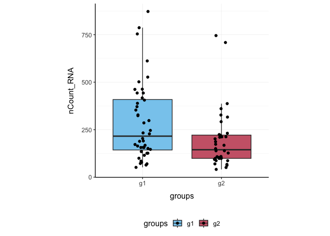
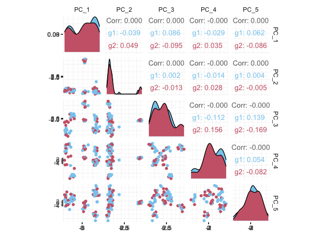

tidyseurat - part of tidytranscriptomics
================

<!-- badges: start -->

[](https://lifecycle.r-lib.org/articles/stages.html)
[](https://github.com/stemangiola/tidyseurat/actions/)
<!-- badges: end -->

**Brings Seurat to the tidyverse\!**

website:
[stemangiola.github.io/tidyseurat/](https://stemangiola.github.io/tidyseurat/)

Please also have a look at

  - [tidybulk](https://stemangiola.github.io/tidybulk/) for tidy bulk
    RNA-seq analysis
  - [nanny](https://github.com/stemangiola/nanny/) for tidy high-level
    data analysis and manipulation
  - [tidygate](https://github.com/stemangiola/tidygate/) for adding
    custom gate information to your tibble
  - [tidyHeatmap](https://stemangiola.github.io/tidyHeatmap/) for
    heatmaps produced with tidy principles


# Introduction

tidyseurat provides a bridge between the Seurat single-cell package
\[@butler2018integrating; @stuart2019comprehensive\] and the tidyverse
\[@wickham2019welcome\]. It creates an invisible layer that enables
viewing the Seurat object as a tidyverse tibble, and provides
Seurat-compatible *dplyr*, *tidyr*, *ggplot* and *plotly* functions.

## Functions/utilities available

| Seurat-compatible Functions | Description                                            |
| --------------------------- | ------------------------------------------------------ |
| `all`                       | After all `tidyseurat` is a Seurat object, just better |

| tidyverse Packages | Description                          |
| ------------------ | ------------------------------------ |
| `dplyr`            | All `dplyr` APIs like for any tibble |
| `tidyr`            | All `tidyr` APIs like for any tibble |
| `ggplot2`          | `ggplot` like for any tibble         |
| `plotly`           | `plot_ly` like for any tibble        |

| Utilities          | Description                                           |
| ------------------ | ----------------------------------------------------- |
| `tidy`             | Add `tidyseurat` invisible layer over a Seurat object |
| `as_tibble`        | Convert cell-wise information to a `tbl_df`           |
| `join_transcripts` | Add transcript-wise information, returns a `tbl_df`   |

## Installation

From CRAN

``` r
install.packages("tidyseurat")
```

From Github (development)

``` r
devtools::install_github("stemangiola/tidyseurat")
```

``` r
library(dplyr)
library(tidyr)
library(purrr)
library(magrittr)
library(ggplot2)
library(Seurat)
library(tidyseurat)
```

## Create `tidyseurat`, the best of both worlds\!

This is a seurat object but it is evaluated as tibble. So it is fully
compatible both with Seurat and tidyverse APIs.

``` r
pbmc_small <- tidyseurat::pbmc_small 
```

**It looks like a tibble**

``` r
pbmc_small
```

    ## # A Seurat-tibble abstraction: 80 x 16
    ## [90m# Transcripts=230 | Active assay=RNA | Assays=RNA[39m
    ##    cell  orig.ident nCount_RNA nFeature_RNA RNA_snn_res.0.8 letter.idents groups
    ##    <chr> <fct>           <dbl>        <int> <fct>           <fct>         <chr> 
    ##  1 ATGC… SeuratPro…         70           47 0               A             g2    
    ##  2 CATG… SeuratPro…         85           52 0               A             g1    
    ##  3 GAAC… SeuratPro…         87           50 1               B             g2    
    ##  4 TGAC… SeuratPro…        127           56 0               A             g2    
    ##  5 AGTC… SeuratPro…        173           53 0               A             g2    
    ##  6 TCTG… SeuratPro…         70           48 0               A             g1    
    ##  7 TGGT… SeuratPro…         64           36 0               A             g1    
    ##  8 GCAG… SeuratPro…         72           45 0               A             g1    
    ##  9 GATA… SeuratPro…         52           36 0               A             g1    
    ## 10 AATG… SeuratPro…        100           41 0               A             g1    
    ## # … with 70 more rows, and 9 more variables: RNA_snn_res.1 <fct>, file <chr>,
    ## #   PC_1 <dbl>, PC_2 <dbl>, PC_3 <dbl>, PC_4 <dbl>, PC_5 <dbl>, tSNE_1 <dbl>,
    ## #   tSNE_2 <dbl>

**But it is a Seurat object after all**

``` r
pbmc_small@assays
```

    ## $RNA
    ## Assay data with 230 features for 80 cells
    ## Top 10 variable features:
    ##  PPBP, IGLL5, VDAC3, CD1C, AKR1C3, PF4, MYL9, GNLY, TREML1, CA2

# Annotation polishing

We may have a column that contains the directory each run was taken
from, such as the “file” column in `pbmc_small`.

``` r
pbmc_small$file[1:5]
```

    ##                                     ATGCCAGAACGACT 
    ## "../data/sample2/outs/filtered_feature_bc_matrix/" 
    ##                                     CATGGCCTGTGCAT 
    ## "../data/sample1/outs/filtered_feature_bc_matrix/" 
    ##                                     GAACCTGATGAACC 
    ## "../data/sample2/outs/filtered_feature_bc_matrix/" 
    ##                                     TGACTGGATTCTCA 
    ## "../data/sample2/outs/filtered_feature_bc_matrix/" 
    ##                                     AGTCAGACTGCACA 
    ## "../data/sample2/outs/filtered_feature_bc_matrix/"

We may want to extract the run/sample name out of it into a separate
column. Tidyverse `extract` can be used to convert a character column
into multiple columns using regular expression groups.

``` r
# Create sample column
pbmc_small_polished <-
  pbmc_small
  extract(file, "sample", "../data/([a-z0-9]+)/outs.+", remove = FALSE)
# Reorder to have sample column up front
pbmc_small_polished %>%
  select(sample, everything())
```

    ## # A Seurat-tibble abstraction: 80 x 17
    ## [90m# Transcripts=230 | Active assay=RNA | Assays=RNA[39m
    ##    cell  sample orig.ident nCount_RNA nFeature_RNA RNA_snn_res.0.8 letter.idents
    ##    <chr> <chr>  <fct>           <dbl>        <int> <fct>           <fct>        
    ##  1 ATGC… sampl… SeuratPro…         70           47 0               A            
    ##  2 CATG… sampl… SeuratPro…         85           52 0               A            
    ##  3 GAAC… sampl… SeuratPro…         87           50 1               B            
    ##  4 TGAC… sampl… SeuratPro…        127           56 0               A            
    ##  5 AGTC… sampl… SeuratPro…        173           53 0               A            
    ##  6 TCTG… sampl… SeuratPro…         70           48 0               A            
    ##  7 TGGT… sampl… SeuratPro…         64           36 0               A            
    ##  8 GCAG… sampl… SeuratPro…         72           45 0               A            
    ##  9 GATA… sampl… SeuratPro…         52           36 0               A            
    ## 10 AATG… sampl… SeuratPro…        100           41 0               A            
    ## # … with 70 more rows, and 10 more variables: groups <chr>,
    ## #   RNA_snn_res.1 <fct>, file <chr>, PC_1 <dbl>, PC_2 <dbl>, PC_3 <dbl>,
    ## #   PC_4 <dbl>, PC_5 <dbl>, tSNE_1 <dbl>, tSNE_2 <dbl>

# Preliminary plots

Set colours and theme for plots.

``` r
# Use colourblind-friendly colours
friendly_cols <- c("#88CCEE", "#CC6677", "#DDCC77", "#117733", "#332288", "#AA4499", "#44AA99", "#999933", "#882255", "#661100", "#6699CC")

# Set theme
my_theme <-
  list(
    scale_fill_manual(values = friendly_cols),
    scale_color_manual(values = friendly_cols),
    theme_bw() +
      theme(
        panel.border = element_blank(),
        axis.line = element_line(),
        panel.grid.major = element_line(size = 0.2),
        panel.grid.minor = element_line(size = 0.1),
        text = element_text(size = 12),
        legend.position = "bottom",
        aspect.ratio = 1,
        strip.background = element_blank(),
        axis.title.x = element_text(margin = margin(t = 10, r = 10, b = 10, l = 10)),
        axis.title.y = element_text(margin = margin(t = 10, r = 10, b = 10, l = 10))
      )
  )
```

We can treat `pbmc_small_polished` effectively as a normal tibble for
plotting.

Here we plot number of transcripts per cell.

``` r
pbmc_small_polished %>%
  tidyseurat::ggplot(aes(nFeature_RNA, fill = groups)) +
  geom_histogram() +
  my_theme
```

<!-- -->

Here we plot total transcripts per cell.

``` r
pbmc_small_polished %>%
  tidyseurat::ggplot(aes(groups, nCount_RNA, fill = groups)) +
  geom_boxplot(outlier.shape = NA) +
  geom_jitter(width = 0.1) +
  my_theme
```

<!-- -->

Here we plot abundance of two transcripts for each group.

``` r
pbmc_small_polished %>%
  join_transcripts(transcripts = c("HLA-DRA", "LYZ")) %>%
  ggplot(aes(groups, abundance_RNA + 1, fill = groups)) +
  geom_boxplot(outlier.shape = NA) +
  geom_jitter(aes(size = nCount_RNA), alpha = 0.5, width = 0.2) +
  scale_y_log10() +
  my_theme
```

<!-- -->

# Preprocess the dataset

Also you can treat the object as Seurat object and proceed with data
processing.

``` r
pbmc_small_pca <-
  pbmc_small_polished %>%
  SCTransform(verbose = FALSE) %>%
  FindVariableFeatures(verbose = FALSE) %>%
  RunPCA(verbose = FALSE)

pbmc_small_pca
```

    ## # A Seurat-tibble abstraction: 80 x 19
    ## [90m# Transcripts=220 | Active assay=SCT | Assays=RNA, SCT[39m
    ##    cell  orig.ident nCount_RNA nFeature_RNA RNA_snn_res.0.8 letter.idents groups
    ##    <chr> <fct>           <dbl>        <int> <fct>           <fct>         <chr> 
    ##  1 ATGC… SeuratPro…         70           47 0               A             g2    
    ##  2 CATG… SeuratPro…         85           52 0               A             g1    
    ##  3 GAAC… SeuratPro…         87           50 1               B             g2    
    ##  4 TGAC… SeuratPro…        127           56 0               A             g2    
    ##  5 AGTC… SeuratPro…        173           53 0               A             g2    
    ##  6 TCTG… SeuratPro…         70           48 0               A             g1    
    ##  7 TGGT… SeuratPro…         64           36 0               A             g1    
    ##  8 GCAG… SeuratPro…         72           45 0               A             g1    
    ##  9 GATA… SeuratPro…         52           36 0               A             g1    
    ## 10 AATG… SeuratPro…        100           41 0               A             g1    
    ## # … with 70 more rows, and 12 more variables: RNA_snn_res.1 <fct>, file <chr>,
    ## #   sample <chr>, nCount_SCT <dbl>, nFeature_SCT <int>, PC_1 <dbl>, PC_2 <dbl>,
    ## #   PC_3 <dbl>, PC_4 <dbl>, PC_5 <dbl>, tSNE_1 <dbl>, tSNE_2 <dbl>

If a tool is not included in the tidyseurat collection, we can use
`as_tibble` to permanently convert `tidyseurat` into tibble.

``` r
pbmc_small_pca %>%
  as_tibble() %>%
  select(contains("PC"), everything()) %>%
  GGally::ggpairs(columns = 1:5, ggplot2::aes(colour = groups)) +
  my_theme
```

<!-- -->

# Identify clusters

We proceed with cluster identification with Seurat.

``` r
pbmc_small_cluster <-
  pbmc_small_pca %>%
  FindNeighbors(verbose = FALSE) %>%
  FindClusters(method = "igraph", verbose = FALSE)

pbmc_small_cluster
```

    ## # A Seurat-tibble abstraction: 80 x 21
    ## [90m# Transcripts=220 | Active assay=SCT | Assays=RNA, SCT[39m
    ##    cell  orig.ident nCount_RNA nFeature_RNA RNA_snn_res.0.8 letter.idents groups
    ##    <chr> <fct>           <dbl>        <int> <fct>           <fct>         <chr> 
    ##  1 ATGC… SeuratPro…         70           47 0               A             g2    
    ##  2 CATG… SeuratPro…         85           52 0               A             g1    
    ##  3 GAAC… SeuratPro…         87           50 1               B             g2    
    ##  4 TGAC… SeuratPro…        127           56 0               A             g2    
    ##  5 AGTC… SeuratPro…        173           53 0               A             g2    
    ##  6 TCTG… SeuratPro…         70           48 0               A             g1    
    ##  7 TGGT… SeuratPro…         64           36 0               A             g1    
    ##  8 GCAG… SeuratPro…         72           45 0               A             g1    
    ##  9 GATA… SeuratPro…         52           36 0               A             g1    
    ## 10 AATG… SeuratPro…        100           41 0               A             g1    
    ## # … with 70 more rows, and 14 more variables: RNA_snn_res.1 <fct>, file <chr>,
    ## #   sample <chr>, nCount_SCT <dbl>, nFeature_SCT <int>, SCT_snn_res.0.8 <fct>,
    ## #   seurat_clusters <fct>, PC_1 <dbl>, PC_2 <dbl>, PC_3 <dbl>, PC_4 <dbl>,
    ## #   PC_5 <dbl>, tSNE_1 <dbl>, tSNE_2 <dbl>

Now we can interrogate the object as if it was a regular tibble data
frame.

``` r
pbmc_small_cluster %>%
  tidyseurat::count(groups, seurat_clusters)
```

    ## # A tibble: 8 x 3
    ##   groups seurat_clusters     n
    ##   <chr>  <fct>           <int>
    ## 1 g1     0                  17
    ## 2 g1     1                  14
    ## 3 g1     2                   9
    ## 4 g1     3                   4
    ## 5 g2     0                  13
    ## 6 g2     1                  12
    ## 7 g2     2                   6
    ## 8 g2     3                   5

We can identify cluster markers using Seurat.

<!-- If this is Seurat v4, comment out the v3 markers -->

<!--


```r
# Identify top 10 markers per cluster
markers <-
  pbmc_small_cluster %>%
  FindAllMarkers(only.pos = TRUE, min.pct = 0.25, thresh.use = 0.25) %>%
  group_by(cluster) %>%
  top_n(10, avg_logFC)

# Plot heatmap
pbmc_small_cluster %>%
  DoHeatmap(
    features = markers$gene,
    group.colors = friendly_cols
  )
```

-->

<!-- If this is Seurat v3, comment out the v4 markers -->

``` r
# Identify top 10 markers per cluster
markers <-
  pbmc_small_cluster %>%
  FindAllMarkers(only.pos = TRUE, min.pct = 0.25, thresh.use = 0.25) %>%
  group_by(cluster) %>%
  top_n(10, avg_log2FC)

# Plot heatmap
pbmc_small_cluster %>%
  DoHeatmap(
    features = markers$gene,
    group.colors = friendly_cols
  )
```

<!-- -->

# Reduce dimensions

We can calculate the first 3 UMAP dimensions using the Seurat framework.

``` r
pbmc_small_UMAP <-
  pbmc_small_cluster %>%
  RunUMAP(reduction = "pca", dims = 1:15, n.components = 3L, )
```

And we can plot them using 3D plot using plotly.

``` r
pbmc_small_UMAP %>%
  plot_ly(
    x = ~`UMAP_1`,
    y = ~`UMAP_2`,
    z = ~`UMAP_3`,
    color = ~seurat_clusters,
    colors = friendly_cols[1:4]
  )
```


## Cell type prediction

We can infer cell type identities using *SingleR* \[@aran2019reference\]
and manipulate the output using tidyverse.

``` r
# Get cell type reference data
blueprint <- celldex::BlueprintEncodeData()

# Infer cell identities
cell_type_df <-
  pbmc_small_UMAP@assays[["SCT"]]@counts %>%
  log1p() %>%
  Matrix::Matrix(sparse = TRUE) %>%
  SingleR::SingleR(
    ref = blueprint,
    labels = blueprint$label.main,
    method = "single"
  ) %>%
  as.data.frame() %>%
  as_tibble(rownames = "cell") %>%
  select(cell, first.labels)
```

``` r
# Join UMAP and cell type info
pbmc_small_cell_type <-
  pbmc_small_UMAP %>%
  left_join(cell_type_df, by = "cell")

# Reorder columns
pbmc_small_cell_type %>%
  tidyseurat::select(cell, first.labels, everything())
```

    ## # A Seurat-tibble abstraction: 80 x 25
    ## [90m# Transcripts=220 | Active assay=SCT | Assays=RNA, SCT[39m
    ##    cell  first.labels orig.ident nCount_RNA nFeature_RNA RNA_snn_res.0.8
    ##    <chr> <chr>        <fct>           <dbl>        <int> <fct>          
    ##  1 ATGC… CD4+ T-cells SeuratPro…         70           47 0              
    ##  2 CATG… CD8+ T-cells SeuratPro…         85           52 0              
    ##  3 GAAC… CD8+ T-cells SeuratPro…         87           50 1              
    ##  4 TGAC… CD4+ T-cells SeuratPro…        127           56 0              
    ##  5 AGTC… CD4+ T-cells SeuratPro…        173           53 0              
    ##  6 TCTG… CD4+ T-cells SeuratPro…         70           48 0              
    ##  7 TGGT… CD4+ T-cells SeuratPro…         64           36 0              
    ##  8 GCAG… CD4+ T-cells SeuratPro…         72           45 0              
    ##  9 GATA… CD4+ T-cells SeuratPro…         52           36 0              
    ## 10 AATG… CD4+ T-cells SeuratPro…        100           41 0              
    ## # … with 70 more rows, and 19 more variables: letter.idents <fct>,
    ## #   groups <chr>, RNA_snn_res.1 <fct>, file <chr>, sample <chr>,
    ## #   nCount_SCT <dbl>, nFeature_SCT <int>, SCT_snn_res.0.8 <fct>,
    ## #   seurat_clusters <fct>, PC_1 <dbl>, PC_2 <dbl>, PC_3 <dbl>, PC_4 <dbl>,
    ## #   PC_5 <dbl>, tSNE_1 <dbl>, tSNE_2 <dbl>, UMAP_1 <dbl>, UMAP_2 <dbl>,
    ## #   UMAP_3 <dbl>

We can easily summarise the results. For example, we can see how cell
type classification overlaps with cluster classification.

``` r
pbmc_small_cell_type %>%
  count(seurat_clusters, first.labels)
```

    ## # A tibble: 9 x 3
    ##   seurat_clusters first.labels     n
    ##   <fct>           <chr>        <int>
    ## 1 0               CD4+ T-cells     8
    ## 2 0               CD8+ T-cells    10
    ## 3 0               NK cells        12
    ## 4 1               Macrophages      1
    ## 5 1               Monocytes       25
    ## 6 2               B-cells         10
    ## 7 2               Macrophages      1
    ## 8 2               Monocytes        4
    ## 9 3               Erythrocytes     9

We can easily reshape the data for building information-rich faceted
plots.

``` r
pbmc_small_cell_type %>%

  # Reshape and add classifier column
  pivot_longer(
    cols = c(seurat_clusters, first.labels),
    names_to = "classifier", values_to = "label"
  ) %>%

  # UMAP plots for cell type and cluster
  ggplot(aes(UMAP_1, UMAP_2, color = label)) +
  geom_point() +
  facet_wrap(~classifier) +
  my_theme
```

<!-- -->

We can easily plot gene correlation per cell category, adding
multi-layer annotations.

``` r
pbmc_small_cell_type %>%

  # Add some mitochondrial abundance values
  mutate(mitochondrial = rnorm(n())) %>%

  # Plot correlation
  join_transcripts(transcripts = c("CST3", "LYZ"), shape = "wide") %>%
  ggplot(aes(CST3 + 1, LYZ + 1, color = groups, size = mitochondrial)) +
  geom_point() +
  facet_wrap(~first.labels, scales = "free") +
  scale_x_log10() +
  scale_y_log10() +
  my_theme
```

<!-- -->

# Nested analyses

A powerful tool we can use with tidyseurat is `nest`. We can easily
perform independent analyses on subsets of the dataset. First we
classify cell types in lymphoid and myeloid; then, nest based on the new
classification

``` r
pbmc_small_nested <-
  pbmc_small_cell_type %>%
  filter(first.labels != "Erythrocytes") %>%
  mutate(cell_class = if_else(`first.labels` %in% c("Macrophages", "Monocytes"), "myeloid", "lymphoid")) %>%
  nest(data = -cell_class)

pbmc_small_nested
```

    ## # A tibble: 2 x 2
    ##   cell_class data      
    ##   <chr>      <list>    
    ## 1 lymphoid   <tidysert>
    ## 2 myeloid    <tidysert>

Now we can independently for the lymphoid and myeloid subsets (i) find
variable features, (ii) reduce dimensions, and (iii) cluster using both
tidyverse and SingleCellExperiment seamlessly.

``` r
pbmc_small_nested_reanalysed <-
  pbmc_small_nested %>%
  mutate(data = map(
    data, ~ .x %>%
      FindVariableFeatures(verbose = FALSE) %>%
      RunPCA(npcs = 10, verbose = FALSE) %>%
      FindNeighbors(verbose = FALSE) %>%
      FindClusters(method = "igraph", verbose = FALSE) %>%
      RunUMAP(reduction = "pca", dims = 1:10, n.components = 3L, verbose = FALSE)
  ))

pbmc_small_nested_reanalysed
```

    ## # A tibble: 2 x 2
    ##   cell_class data      
    ##   <chr>      <list>    
    ## 1 lymphoid   <tidysert>
    ## 2 myeloid    <tidysert>

Now we can unnest and plot the new classification.

``` r
pbmc_small_nested_reanalysed %>%

  # Convert to tibble otherwise Seurat drops reduced dimensions when unifying data sets.
  mutate(data = map(data, ~ .x %>% as_tibble())) %>%
  unnest(data) %>%

  # Define unique clusters
  unite("cluster", c(cell_class, seurat_clusters), remove = FALSE) %>%

  # Plotting
  ggplot(aes(UMAP_1, UMAP_2, color = cluster)) +
  geom_point() +
  facet_wrap(~cell_class) +
  my_theme
```

<!-- -->
