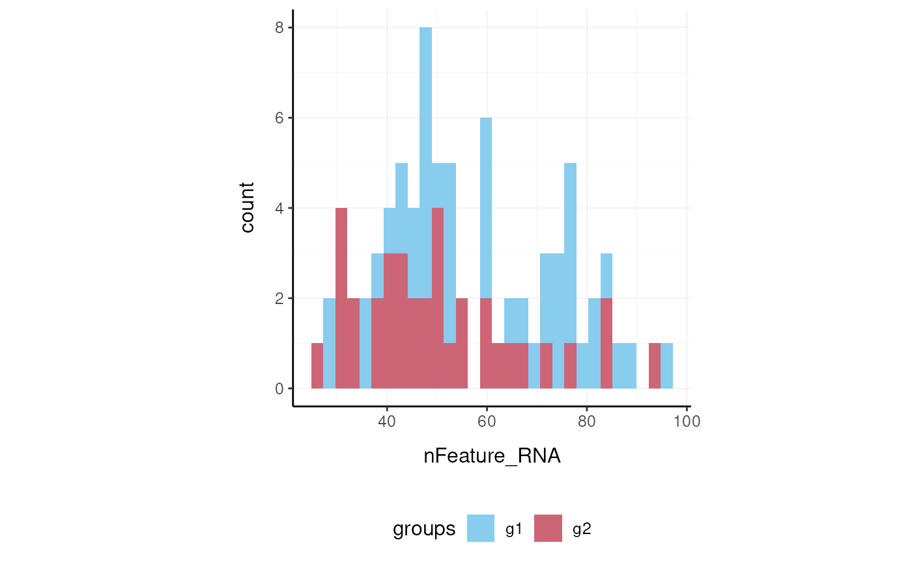
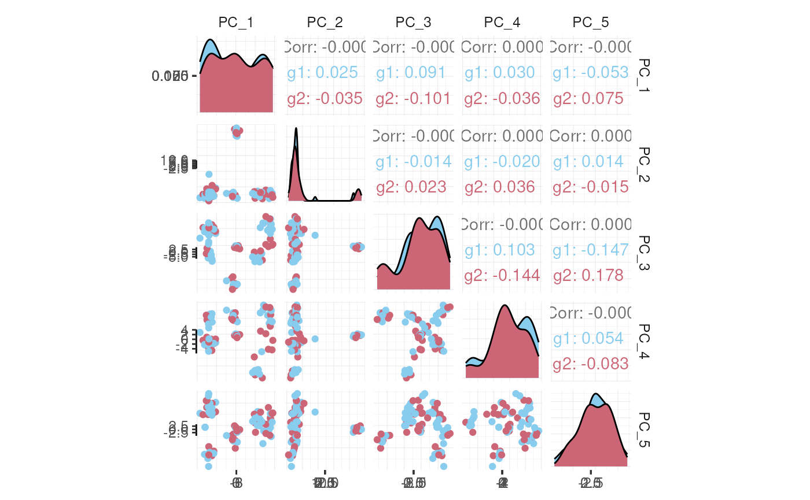

# Overview of the tidyseurat package

[](https://lifecycle.r-lib.org/articles/stages.html)

**Brings Seurat to the tidyverse!**

website:
[stemangiola.github.io/tidyseurat/](https://stemangiola.github.io/tidyseurat/)

Please also have a look at

- [tidyseurat](https://stemangiola.github.io/tidyseurat/) for tidy
  single-cell RNA sequencing analysis
- [tidySummarizedExperiment](https://tidyomics.github.io/tidySummarizedExperiment/)
  for tidy bulk RNA sequencing analysis
- [tidybulk](https://tidyomics.github.io/tidybulk/) for tidy bulk
  RNA-seq analysis
- [tidygate](https://github.com/stemangiola/tidygate/) for adding custom
  gate information to your tibble
- [tidyHeatmap](https://stemangiola.github.io/tidyHeatmap/) for heatmaps
  produced with tidy principles


visual cue

## Introduction

tidyseurat provides a bridge between the Seurat single-cell package
(Butler et al. 2018; Stuart et al. 2019) and the tidyverse (Wickham et
al. 2019). It creates an invisible layer that enables viewing the Seurat
object as a tidyverse tibble, and provides Seurat-compatible *dplyr*,
*tidyr*, *ggplot* and *plotly* functions.

### Functions/utilities available

| Seurat-compatible Functions | Description |
|-----------------------------|-------------|
| `all`                       |             |

| tidyverse Packages | Description                          |
|--------------------|--------------------------------------|
| `dplyr`            | All `dplyr` APIs like for any tibble |
| `tidyr`            | All `tidyr` APIs like for any tibble |
| `ggplot2`          | `ggplot` like for any tibble         |
| `plotly`           | `plot_ly` like for any tibble        |

| Utilities | Description |
|----|----|
| `tidy` | Add `tidyseurat` invisible layer over a Seurat object |
| `as_tibble` | Convert cell-wise information to a `tbl_df` |
| `join_features` | Add feature-wise information, returns a `tbl_df` |
| `aggregate_cells` | Aggregate cell gene-transcription abundance as pseudobulk tissue |

### Installation

From CRAN

``` r

install.packages("tidyseurat")
```

From Github (development)

``` r

devtools::install_github("stemangiola/tidyseurat")
```

``` r

library(dplyr)
library(tidyr)
library(purrr)
library(magrittr)
library(ggplot2)
library(Seurat)
library(tidyseurat)
```

### Create `tidyseurat`, the best of both worlds!

This is a seurat object but it is evaluated as tibble. So it is fully
compatible both with Seurat and tidyverse APIs.

``` r

pbmc_small = SeuratObject::pbmc_small
```

**It looks like a tibble**

``` r

pbmc_small
```

    ## # A Seurat-tibble abstraction: 80 × 15
    ## # Features=230 | Cells=80 | Active assay=RNA | Assays=RNA
    ##    .cell orig.ident nCount_RNA nFeature_RNA RNA_snn_res.0.8 letter.idents groups
    ##    <chr> <fct>           <dbl>        <int> <fct>           <fct>         <chr> 
    ##  1 ATGC… SeuratPro…         70           47 0               A             g2    
    ##  2 CATG… SeuratPro…         85           52 0               A             g1    
    ##  3 GAAC… SeuratPro…         87           50 1               B             g2    
    ##  4 TGAC… SeuratPro…        127           56 0               A             g2    
    ##  5 AGTC… SeuratPro…        173           53 0               A             g2    
    ##  6 TCTG… SeuratPro…         70           48 0               A             g1    
    ##  7 TGGT… SeuratPro…         64           36 0               A             g1    
    ##  8 GCAG… SeuratPro…         72           45 0               A             g1    
    ##  9 GATA… SeuratPro…         52           36 0               A             g1    
    ## 10 AATG… SeuratPro…        100           41 0               A             g1    
    ## # ℹ 70 more rows
    ## # ℹ 8 more variables: RNA_snn_res.1 <fct>, PC_1 <dbl>, PC_2 <dbl>, PC_3 <dbl>,
    ## #   PC_4 <dbl>, PC_5 <dbl>, tSNE_1 <dbl>, tSNE_2 <dbl>

**But it is a Seurat object after all**

``` r

pbmc_small@assays
```

    ## $RNA
    ## Assay data with 230 features for 80 cells
    ## Top 10 variable features:
    ##  PPBP, IGLL5, VDAC3, CD1C, AKR1C3, PF4, MYL9, GNLY, TREML1, CA2

## Preliminary plots

Set colours and theme for plots.

``` r

# Use colourblind-friendly colours
friendly_cols <- c("#88CCEE", "#CC6677", "#DDCC77", "#117733", "#332288", "#AA4499", "#44AA99", "#999933", "#882255", "#661100", "#6699CC")

# Set theme
my_theme <-
  list(
    scale_fill_manual(values = friendly_cols),
    scale_color_manual(values = friendly_cols),
    theme_bw() +
      theme(
        panel.border = element_blank(),
        axis.line = element_line(),
        panel.grid.major = element_line(size = 0.2),
        panel.grid.minor = element_line(size = 0.1),
        text = element_text(size = 12),
        legend.position = "bottom",
        aspect.ratio = 1,
        strip.background = element_blank(),
        axis.title.x = element_text(margin = margin(t = 10, r = 10, b = 10, l = 10)),
        axis.title.y = element_text(margin = margin(t = 10, r = 10, b = 10, l = 10))
      )
  )
```

We can treat `pbmc_small` effectively as a normal tibble for plotting.

Here we plot number of features per cell.

``` r

pbmc_small %>%
  ggplot(aes(nFeature_RNA, fill = groups)) +
  geom_histogram() +
  my_theme
```



Here we plot total features per cell.

``` r

pbmc_small %>%
  ggplot(aes(groups, nCount_RNA, fill = groups)) +
  geom_boxplot(outlier.shape = NA) +
  geom_jitter(width = 0.1) +
  my_theme
```


Here we plot abundance of two features for each group.

``` r

pbmc_small %>%
  join_features(features = c("HLA-DRA", "LYZ"), shape = "long") %>%
  ggplot(aes(groups, .abundance_RNA + 1, fill = groups)) +
  geom_boxplot(outlier.shape = NA) +
  geom_jitter(aes(size = nCount_RNA), alpha = 0.5, width = 0.2) +
  scale_y_log10() +
  my_theme
```


## Preprocess the dataset

Also you can treat the object as Seurat object and proceed with data
processing.

``` r

pbmc_small_pca <-
  pbmc_small %>%
  SCTransform(verbose = FALSE) %>%
  FindVariableFeatures(verbose = FALSE) %>%
  RunPCA(verbose = FALSE)

pbmc_small_pca
```

    ## # A Seurat-tibble abstraction: 80 × 17
    ## # Features=220 | Cells=80 | Active assay=SCT | Assays=RNA, SCT
    ##    .cell orig.ident nCount_RNA nFeature_RNA RNA_snn_res.0.8 letter.idents groups
    ##    <chr> <fct>           <dbl>        <int> <fct>           <fct>         <chr> 
    ##  1 ATGC… SeuratPro…         70           47 0               A             g2    
    ##  2 CATG… SeuratPro…         85           52 0               A             g1    
    ##  3 GAAC… SeuratPro…         87           50 1               B             g2    
    ##  4 TGAC… SeuratPro…        127           56 0               A             g2    
    ##  5 AGTC… SeuratPro…        173           53 0               A             g2    
    ##  6 TCTG… SeuratPro…         70           48 0               A             g1    
    ##  7 TGGT… SeuratPro…         64           36 0               A             g1    
    ##  8 GCAG… SeuratPro…         72           45 0               A             g1    
    ##  9 GATA… SeuratPro…         52           36 0               A             g1    
    ## 10 AATG… SeuratPro…        100           41 0               A             g1    
    ## # ℹ 70 more rows
    ## # ℹ 10 more variables: RNA_snn_res.1 <fct>, nCount_SCT <dbl>,
    ## #   nFeature_SCT <int>, PC_1 <dbl>, PC_2 <dbl>, PC_3 <dbl>, PC_4 <dbl>,
    ## #   PC_5 <dbl>, tSNE_1 <dbl>, tSNE_2 <dbl>

If a tool is not included in the tidyseurat collection, we can use
`as_tibble` to permanently convert `tidyseurat` into tibble.

``` r

pbmc_small_pca %>%
  as_tibble() %>%
  select(contains("PC"), everything()) %>%
  GGally::ggpairs(columns = 1:5, ggplot2::aes(colour = groups)) +
  my_theme
```



## Identify clusters

We proceed with cluster identification with Seurat.

``` r

pbmc_small_cluster <-
  pbmc_small_pca %>%
  FindNeighbors(verbose = FALSE) %>%
  FindClusters(method = "igraph", verbose = FALSE)

pbmc_small_cluster
```

    ## # A Seurat-tibble abstraction: 80 × 19
    ## # Features=220 | Cells=80 | Active assay=SCT | Assays=RNA, SCT
    ##    .cell orig.ident nCount_RNA nFeature_RNA RNA_snn_res.0.8 letter.idents groups
    ##    <chr> <fct>           <dbl>        <int> <fct>           <fct>         <chr> 
    ##  1 ATGC… SeuratPro…         70           47 0               A             g2    
    ##  2 CATG… SeuratPro…         85           52 0               A             g1    
    ##  3 GAAC… SeuratPro…         87           50 1               B             g2    
    ##  4 TGAC… SeuratPro…        127           56 0               A             g2    
    ##  5 AGTC… SeuratPro…        173           53 0               A             g2    
    ##  6 TCTG… SeuratPro…         70           48 0               A             g1    
    ##  7 TGGT… SeuratPro…         64           36 0               A             g1    
    ##  8 GCAG… SeuratPro…         72           45 0               A             g1    
    ##  9 GATA… SeuratPro…         52           36 0               A             g1    
    ## 10 AATG… SeuratPro…        100           41 0               A             g1    
    ## # ℹ 70 more rows
    ## # ℹ 12 more variables: RNA_snn_res.1 <fct>, nCount_SCT <dbl>,
    ## #   nFeature_SCT <int>, SCT_snn_res.0.8 <fct>, seurat_clusters <fct>,
    ## #   PC_1 <dbl>, PC_2 <dbl>, PC_3 <dbl>, PC_4 <dbl>, PC_5 <dbl>, tSNE_1 <dbl>,
    ## #   tSNE_2 <dbl>

Now we can interrogate the object as if it was a regular tibble data
frame.

``` r

pbmc_small_cluster %>%
  count(groups, seurat_clusters)
```

    ## # A tibble: 6 × 3
    ##   groups seurat_clusters     n
    ##   <chr>  <fct>           <int>
    ## 1 g1     0                  23
    ## 2 g1     1                  17
    ## 3 g1     2                   4
    ## 4 g2     0                  17
    ## 5 g2     1                  13
    ## 6 g2     2                   6

We can identify cluster markers using Seurat.

``` r

# Identify top 10 markers per cluster
markers <-
  pbmc_small_cluster %>%
  FindAllMarkers(only.pos = TRUE, min.pct = 0.25, thresh.use = 0.25) %>%
  group_by(cluster) %>%
  top_n(10, avg_log2FC)

# Plot heatmap
pbmc_small_cluster %>%
  DoHeatmap(
    features = markers$gene,
    group.colors = friendly_cols
  )
```

## Reduce dimensions

We can calculate the first 3 UMAP dimensions using the Seurat framework.

``` r

pbmc_small_UMAP <-
  pbmc_small_cluster %>%
  RunUMAP(reduction = "pca", dims = 1:15, n.components = 3L)
```

And we can plot them using 3D plot using plotly.

``` r

pbmc_small_UMAP %>%
  plot_ly(
    x = ~`UMAP_1`,
    y = ~`UMAP_2`,
    z = ~`UMAP_3`,
    color = ~seurat_clusters,
    colors = friendly_cols[1:4]
  )
```


screenshot plotly

### Cell type prediction

We can infer cell type identities using *SingleR* (Aran et al. 2019) and
manipulate the output using tidyverse.

``` r

# Get cell type reference data
blueprint <- celldex::BlueprintEncodeData()

# Infer cell identities
cell_type_df <-
  GetAssayData(pbmc_small_UMAP, slot = 'counts', assay = "SCT") %>%
  log1p() %>%
  Matrix::Matrix(sparse = TRUE) %>%
  SingleR::SingleR(
    ref = blueprint,
    labels = blueprint$label.main,
    method = "single"
  ) %>%
  as.data.frame() %>%
  as_tibble(rownames = "cell") %>%
  select(cell, first.labels)
```

``` r

# Join UMAP and cell type info
pbmc_small_cell_type <-
  pbmc_small_UMAP %>%
  left_join(cell_type_df, by = "cell")

# Reorder columns
pbmc_small_cell_type %>%
  select(cell, first.labels, everything())
```

We can easily summarise the results. For example, we can see how cell
type classification overlaps with cluster classification.

``` r

pbmc_small_cell_type %>%
  count(seurat_clusters, first.labels)
```

We can easily reshape the data for building information-rich faceted
plots.

``` r

pbmc_small_cell_type %>%

  # Reshape and add classifier column
  pivot_longer(
    cols = c(seurat_clusters, first.labels),
    names_to = "classifier", values_to = "label"
  ) %>%

  # UMAP plots for cell type and cluster
  ggplot(aes(UMAP_1, UMAP_2, color = label)) +
  geom_point() +
  facet_wrap(~classifier) +
  my_theme
```

We can easily plot gene correlation per cell category, adding
multi-layer annotations.

``` r

pbmc_small_cell_type %>%

  # Add some mitochondrial abundance values
  mutate(mitochondrial = rnorm(n())) %>%

  # Plot correlation
  join_features(features = c("CST3", "LYZ"), shape = "wide") %>%
  ggplot(aes(CST3 + 1, LYZ + 1, color = groups, size = mitochondrial)) +
  geom_point() +
  facet_wrap(~first.labels, scales = "free") +
  scale_x_log10() +
  scale_y_log10() +
  my_theme
```

## Nested analyses

A powerful tool we can use with tidyseurat is `nest`. We can easily
perform independent analyses on subsets of the dataset. First we
classify cell types in lymphoid and myeloid; then, nest based on the new
classification

``` r

pbmc_small_nested <-
  pbmc_small_cell_type %>%
  filter(first.labels != "Erythrocytes") %>%
  mutate(cell_class = if_else(`first.labels` %in% c("Macrophages", "Monocytes"), "myeloid", "lymphoid")) %>%
  nest(data = -cell_class)

pbmc_small_nested
```

Now we can independently for the lymphoid and myeloid subsets (i) find
variable features, (ii) reduce dimensions, and (iii) cluster using both
tidyverse and Seurat seamlessly.

``` r

pbmc_small_nested_reanalysed <-
  pbmc_small_nested %>%
  mutate(data = map(
    data, ~ .x %>%
      FindVariableFeatures(verbose = FALSE) %>%
      RunPCA(npcs = 10, verbose = FALSE) %>%
      FindNeighbors(verbose = FALSE) %>%
      FindClusters(method = "igraph", verbose = FALSE) %>%
      RunUMAP(reduction = "pca", dims = 1:10, n.components = 3L, verbose = FALSE)
  ))

pbmc_small_nested_reanalysed
```

Now we can unnest and plot the new classification.

``` r

pbmc_small_nested_reanalysed %>%

  # Convert to tibble otherwise Seurat drops reduced dimensions when unifying data sets.
  mutate(data = map(data, ~ .x %>% as_tibble())) %>%
  unnest(data) %>%

  # Define unique clusters
  unite("cluster", c(cell_class, seurat_clusters), remove = FALSE) %>%

  # Plotting
  ggplot(aes(UMAP_1, UMAP_2, color = cluster)) +
  geom_point() +
  facet_wrap(~cell_class) +
  my_theme
```

## Aggregating cells

Sometimes, it is necessary to aggregate the gene-transcript abundance
from a group of cells into a single value. For example, when comparing
groups of cells across different samples with fixed-effect models.

In tidyseurat, cell aggregation can be achieved using the
`aggregate_cells` function.

``` r

pbmc_small %>%
  aggregate_cells(groups, assays = "RNA")
```

## Session Info

``` r

sessionInfo()
```

    ## R Under development (unstable) (2025-11-06 r88990)
    ## Platform: x86_64-pc-linux-gnu
    ## Running under: Ubuntu 24.04.3 LTS
    ## 
    ## Matrix products: default
    ## BLAS:   /usr/lib/x86_64-linux-gnu/openblas-pthread/libblas.so.3 
    ## LAPACK: /usr/lib/x86_64-linux-gnu/openblas-pthread/libopenblasp-r0.3.26.so;  LAPACK version 3.12.0
    ## 
    ## locale:
    ##  [1] LC_CTYPE=en_US.UTF-8       LC_NUMERIC=C              
    ##  [3] LC_TIME=en_US.UTF-8        LC_COLLATE=en_US.UTF-8    
    ##  [5] LC_MONETARY=en_US.UTF-8    LC_MESSAGES=en_US.UTF-8   
    ##  [7] LC_PAPER=en_US.UTF-8       LC_NAME=C                 
    ##  [9] LC_ADDRESS=C               LC_TELEPHONE=C            
    ## [11] LC_MEASUREMENT=en_US.UTF-8 LC_IDENTIFICATION=C       
    ## 
    ## time zone: UTC
    ## tzcode source: system (glibc)
    ## 
    ## attached base packages:
    ## [1] stats     graphics  grDevices utils     datasets  methods   base     
    ## 
    ## other attached packages:
    ##  [1] future_1.67.0      tidyseurat_0.8.7   ttservice_0.5.3    Seurat_5.3.1      
    ##  [5] SeuratObject_5.2.0 sp_2.2-0           ggplot2_4.0.0      magrittr_2.0.4    
    ##  [9] purrr_1.2.0        tidyr_1.3.1        dplyr_1.1.4        knitr_1.50        
    ## 
    ## loaded via a namespace (and not attached):
    ##   [1] deldir_2.0-4           pbapply_1.7-4          gridExtra_2.3         
    ##   [4] rlang_1.1.6            RcppAnnoy_0.0.22       otel_0.2.0            
    ##   [7] spatstat.geom_3.6-0    matrixStats_1.5.0      ggridges_0.5.7        
    ##  [10] compiler_4.6.0         png_0.1-8              systemfonts_1.3.1     
    ##  [13] vctrs_0.6.5            reshape2_1.4.4         stringr_1.6.0         
    ##  [16] pkgconfig_2.0.3        fastmap_1.2.0          labeling_0.4.3        
    ##  [19] utf8_1.2.6             promises_1.5.0         rmarkdown_2.30        
    ##  [22] ragg_1.5.0             xfun_0.54              cachem_1.1.0          
    ##  [25] jsonlite_2.0.0         goftest_1.2-3          later_1.4.4           
    ##  [28] spatstat.utils_3.2-0   irlba_2.3.5.1          parallel_4.6.0        
    ##  [31] cluster_2.1.8.1        R6_2.6.1               ica_1.0-3             
    ##  [34] spatstat.data_3.1-9    bslib_0.9.0            stringi_1.8.7         
    ##  [37] RColorBrewer_1.1-3     GGally_2.4.0           reticulate_1.44.0     
    ##  [40] spatstat.univar_3.1-4  parallelly_1.45.1      lmtest_0.9-40         
    ##  [43] jquerylib_0.1.4        scattermore_1.2        Rcpp_1.1.0            
    ##  [46] tensor_1.5.1           future.apply_1.20.0    zoo_1.8-14            
    ##  [49] sctransform_0.4.2      httpuv_1.6.16          Matrix_1.7-4          
    ##  [52] splines_4.6.0          igraph_2.2.1           tidyselect_1.2.1      
    ##  [55] abind_1.4-8            yaml_2.3.10            spatstat.random_3.4-2 
    ##  [58] spatstat.explore_3.5-3 codetools_0.2-20       miniUI_0.1.2          
    ##  [61] listenv_0.10.0         lattice_0.22-7         tibble_3.3.0          
    ##  [64] plyr_1.8.9             shiny_1.11.1           withr_3.0.2           
    ##  [67] S7_0.2.0               ROCR_1.0-11            evaluate_1.0.5        
    ##  [70] Rtsne_0.17             fastDummies_1.7.5      desc_1.4.3            
    ##  [73] survival_3.8-3         ggstats_0.11.0         polyclip_1.10-7       
    ##  [76] fitdistrplus_1.2-4     pillar_1.11.1          KernSmooth_2.23-26    
    ##  [79] plotly_4.11.0          generics_0.1.4         RcppHNSW_0.6.0        
    ##  [82] scales_1.4.0           globals_0.18.0         xtable_1.8-4          
    ##  [85] glue_1.8.0             lazyeval_0.2.2         tools_4.6.0           
    ##  [88] data.table_1.17.8      RSpectra_0.16-2        RANN_2.6.2            
    ##  [91] fs_1.6.6               dotCall64_1.2          cowplot_1.2.0         
    ##  [94] grid_4.6.0             nlme_3.1-168           patchwork_1.3.2       
    ##  [97] cli_3.6.5              spatstat.sparse_3.1-0  textshaping_1.0.4     
    ## [100] fansi_1.0.6            spam_2.11-1            viridisLite_0.4.2     
    ## [103] uwot_0.2.3             gtable_0.3.6           sass_0.4.10           
    ## [106] digest_0.6.37          progressr_0.18.0       ggrepel_0.9.6         
    ## [109] htmlwidgets_1.6.4      farver_2.1.2           htmltools_0.5.8.1     
    ## [112] pkgdown_2.2.0          lifecycle_1.0.4        httr_1.4.7            
    ## [115] mime_0.13              MASS_7.3-65

## References

Aran, Dvir, Agnieszka P Looney, Leqian Liu, et al. 2019.
“Reference-Based Analysis of Lung Single-Cell Sequencing Reveals a
Transitional Profibrotic Macrophage.” *Nature Immunology* 20 (2):
163–72.

Butler, Andrew, Paul Hoffman, Peter Smibert, Efthymia Papalexi, and
Rahul Satija. 2018. “Integrating Single-Cell Transcriptomic Data Across
Different Conditions, Technologies, and Species.” *Nature Biotechnology*
36 (5): 411–20.

Stuart, Tim, Andrew Butler, Paul Hoffman, et al. 2019. “Comprehensive
Integration of Single-Cell Data.” *Cell* 177 (7): 1888–902.

Wickham, Hadley, Mara Averick, Jennifer Bryan, et al. 2019. “Welcome to
the Tidyverse.” *Journal of Open Source Software* 4 (43): 1686.
