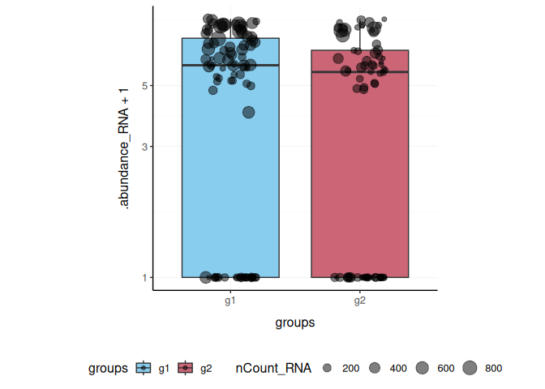

# tidyseurat - part of tidytranscriptomics

[](https://www.youtube.com/watch?feature=player_embedded&v=wKnyocRCvW4)

**Brings Seurat to the tidyverse!**

website:
[stemangiola.github.io/tidyseurat/](https://stemangiola.github.io/tidyseurat/)

Please also have a look at

- [tidyseurat](https://stemangiola.github.io/tidyseurat/) for tidy
  single-cell RNA sequencing analysis
- [tidySummarizedExperiment](https://tidyomics.github.io/tidySummarizedExperiment/)
  for tidy bulk RNA sequencing analysis
- [tidybulk](https://tidyomics.github.io/tidybulk/) for tidy bulk
  RNA-seq analysis
- [tidygate](https://github.com/stemangiola/tidygate/) for adding custom
  gate information to your tibble
- [tidyHeatmap](https://stemangiola.github.io/tidyHeatmap/) for heatmaps
  produced with tidy principles


visual cue

# Introduction

tidyseurat provides a bridge between the Seurat single-cell package
\[@butler2018integrating; @stuart2019comprehensive\] and the tidyverse
\[@wickham2019welcome\]. It creates an invisible layer that enables
viewing the Seurat object as a tidyverse tibble, and provides
Seurat-compatible *dplyr*, *tidyr*, *ggplot* and *plotly* functions.

## Functions/utilities available

| Seurat-compatible Functions | Description |
|-----------------------------|-------------|
| `all`                       |             |

| tidyverse Packages | Description                          |
|--------------------|--------------------------------------|
| `dplyr`            | All `dplyr` APIs like for any tibble |
| `tidyr`            | All `tidyr` APIs like for any tibble |
| `ggplot2`          | `ggplot` like for any tibble         |
| `plotly`           | `plot_ly` like for any tibble        |

| Utilities | Description |
|----|----|
| `tidy` | Add `tidyseurat` invisible layer over a Seurat object |
| `as_tibble` | Convert cell-wise information to a `tbl_df` |
| `join_features` | Add feature-wise information, returns a `tbl_df` |
| `aggregate_cells` | Aggregate cell gene-transcription abundance as pseudobulk tissue |

## Installation

From CRAN

``` r

install.packages("tidyseurat")
```

From Github (development)

``` r

devtools::install_github("stemangiola/tidyseurat")
```

``` r

library(dplyr)
library(tidyr)
library(purrr)
library(magrittr)
library(ggplot2)
library(Seurat)
library(tidyseurat)
```

## Create `tidyseurat`, the best of both worlds!

This is a seurat object but it is evaluated as tibble. So it is fully
compatible both with Seurat and tidyverse APIs.

``` r

pbmc_small = SeuratObject::pbmc_small
```

**It looks like a tibble**

``` r

pbmc_small
```

``` R
## 
[90m# A Seurat-tibble abstraction: 80 × 15
[39m
## 
[90m# 
[90mFeatures=230 | Cells=80 | Active assay=RNA | Assays=RNA
[0m
[39m
##    .cell orig.ident nCount_RNA nFeature_RNA RNA_snn_res.0.8 letter.idents groups
##    
[3m
[90m<chr>
[39m
[23m 
[3m
[90m<fct>
[39m
[23m           
[3m
[90m<dbl>
[39m
[23m        
[3m
[90m<int>
[39m
[23m 
[3m
[90m<fct>
[39m
[23m           
[3m
[90m<fct>
[39m
[23m         
[3m
[90m<chr>
[39m
[23m 
## 
[90m 1
[39m ATGC… SeuratPro…         70           47 0               A             g2    
## 
[90m 2
[39m CATG… SeuratPro…         85           52 0               A             g1    
## 
[90m 3
[39m GAAC… SeuratPro…         87           50 1               B             g2    
## 
[90m 4
[39m TGAC… SeuratPro…        127           56 0               A             g2    
## 
[90m 5
[39m AGTC… SeuratPro…        173           53 0               A             g2    
## 
[90m 6
[39m TCTG… SeuratPro…         70           48 0               A             g1    
## 
[90m 7
[39m TGGT… SeuratPro…         64           36 0               A             g1    
## 
[90m 8
[39m GCAG… SeuratPro…         72           45 0               A             g1    
## 
[90m 9
[39m GATA… SeuratPro…         52           36 0               A             g1    
## 
[90m10
[39m AATG… SeuratPro…        100           41 0               A             g1    
## 
[90m# ℹ 70 more rows
[39m
## 
[90m# ℹ 8 more variables: RNA_snn_res.1 <fct>, PC_1 <dbl>, PC_2 <dbl>, PC_3 <dbl>,
[39m
## 
[90m#   PC_4 <dbl>, PC_5 <dbl>, tSNE_1 <dbl>, tSNE_2 <dbl>
[39m
```

**But it is a Seurat object after all**

``` r

pbmc_small@assays
```

``` R
## $RNA
## Assay data with 230 features for 80 cells
## Top 10 variable features:
##  PPBP, IGLL5, VDAC3, CD1C, AKR1C3, PF4, MYL9, GNLY, TREML1, CA2
```

# Preliminary plots

Set colours and theme for plots.

``` r

# Use colourblind-friendly colours
friendly_cols <- c("#88CCEE", "#CC6677", "#DDCC77", "#117733", "#332288", "#AA4499", "#44AA99", "#999933", "#882255", "#661100", "#6699CC")

# Set theme
my_theme <-
  list(
    scale_fill_manual(values = friendly_cols),
    scale_color_manual(values = friendly_cols),
    theme_bw() +
      theme(
        panel.border = element_blank(),
        axis.line = element_line(),
        panel.grid.major = element_line(size = 0.2),
        panel.grid.minor = element_line(size = 0.1),
        text = element_text(size = 12),
        legend.position = "bottom",
        aspect.ratio = 1,
        strip.background = element_blank(),
        axis.title.x = element_text(margin = margin(t = 10, r = 10, b = 10, l = 10)),
        axis.title.y = element_text(margin = margin(t = 10, r = 10, b = 10, l = 10))
      )
  )
```

We can treat `pbmc_small` effectively as a normal tibble for plotting.

Here we plot number of features per cell.

``` r

pbmc_small %>%
  ggplot(aes(nFeature_RNA, fill = groups)) +
  geom_histogram() +
  my_theme
```


Here we plot total features per cell.

``` r

pbmc_small %>%
  ggplot(aes(groups, nCount_RNA, fill = groups)) +
  geom_boxplot(outlier.shape = NA) +
  geom_jitter(width = 0.1) +
  my_theme
```


Here we plot abundance of two features for each group.

``` r

pbmc_small %>%
  join_features(features = c("HLA-DRA", "LYZ"), shape = "long") %>%
  ggplot(aes(groups, .abundance_RNA + 1, fill = groups)) +
  geom_boxplot(outlier.shape = NA) +
  geom_jitter(aes(size = nCount_RNA), alpha = 0.5, width = 0.2) +
  scale_y_log10() +
  my_theme
```



# Preprocess the dataset

Also you can treat the object as Seurat object and proceed with data
processing.

``` r

pbmc_small_pca <-
  pbmc_small %>%
  SCTransform(verbose = FALSE) %>%
  FindVariableFeatures(verbose = FALSE) %>%
  RunPCA(verbose = FALSE)

pbmc_small_pca
```

``` R
## 
[90m# A Seurat-tibble abstraction: 80 × 17
[39m
## 
[90m# 
[90mFeatures=220 | Cells=80 | Active assay=SCT | Assays=RNA, SCT
[0m
[39m
##    .cell orig.ident nCount_RNA nFeature_RNA RNA_snn_res.0.8 letter.idents groups
##    
[3m
[90m<chr>
[39m
[23m 
[3m
[90m<fct>
[39m
[23m           
[3m
[90m<dbl>
[39m
[23m        
[3m
[90m<int>
[39m
[23m 
[3m
[90m<fct>
[39m
[23m           
[3m
[90m<fct>
[39m
[23m         
[3m
[90m<chr>
[39m
[23m 
## 
[90m 1
[39m ATGC… SeuratPro…         70           47 0               A             g2    
## 
[90m 2
[39m CATG… SeuratPro…         85           52 0               A             g1    
## 
[90m 3
[39m GAAC… SeuratPro…         87           50 1               B             g2    
## 
[90m 4
[39m TGAC… SeuratPro…        127           56 0               A             g2    
## 
[90m 5
[39m AGTC… SeuratPro…        173           53 0               A             g2    
## 
[90m 6
[39m TCTG… SeuratPro…         70           48 0               A             g1    
## 
[90m 7
[39m TGGT… SeuratPro…         64           36 0               A             g1    
## 
[90m 8
[39m GCAG… SeuratPro…         72           45 0               A             g1    
## 
[90m 9
[39m GATA… SeuratPro…         52           36 0               A             g1    
## 
[90m10
[39m AATG… SeuratPro…        100           41 0               A             g1    
## 
[90m# ℹ 70 more rows
[39m
## 
[90m# ℹ 10 more variables: RNA_snn_res.1 <fct>, nCount_SCT <dbl>,
[39m
## 
[90m#   nFeature_SCT <int>, PC_1 <dbl>, PC_2 <dbl>, PC_3 <dbl>, PC_4 <dbl>,
[39m
## 
[90m#   PC_5 <dbl>, tSNE_1 <dbl>, tSNE_2 <dbl>
[39m
```

If a tool is not included in the tidyseurat collection, we can use
`as_tibble` to permanently convert `tidyseurat` into tibble.

``` r

pbmc_small_pca %>%
  as_tibble() %>%
  select(contains("PC"), everything()) %>%
  GGally::ggpairs(columns = 1:5, ggplot2::aes(colour = groups)) +
  my_theme
```


# Identify clusters

We proceed with cluster identification with Seurat.

``` r

pbmc_small_cluster <-
  pbmc_small_pca %>%
  FindNeighbors(verbose = FALSE) %>%
  FindClusters(method = "igraph", verbose = FALSE)

pbmc_small_cluster
```

``` R
## 
[90m# A Seurat-tibble abstraction: 80 × 19
[39m
## 
[90m# 
[90mFeatures=220 | Cells=80 | Active assay=SCT | Assays=RNA, SCT
[0m
[39m
##    .cell orig.ident nCount_RNA nFeature_RNA RNA_snn_res.0.8 letter.idents groups
##    
[3m
[90m<chr>
[39m
[23m 
[3m
[90m<fct>
[39m
[23m           
[3m
[90m<dbl>
[39m
[23m        
[3m
[90m<int>
[39m
[23m 
[3m
[90m<fct>
[39m
[23m           
[3m
[90m<fct>
[39m
[23m         
[3m
[90m<chr>
[39m
[23m 
## 
[90m 1
[39m ATGC… SeuratPro…         70           47 0               A             g2    
## 
[90m 2
[39m CATG… SeuratPro…         85           52 0               A             g1    
## 
[90m 3
[39m GAAC… SeuratPro…         87           50 1               B             g2    
## 
[90m 4
[39m TGAC… SeuratPro…        127           56 0               A             g2    
## 
[90m 5
[39m AGTC… SeuratPro…        173           53 0               A             g2    
## 
[90m 6
[39m TCTG… SeuratPro…         70           48 0               A             g1    
## 
[90m 7
[39m TGGT… SeuratPro…         64           36 0               A             g1    
## 
[90m 8
[39m GCAG… SeuratPro…         72           45 0               A             g1    
## 
[90m 9
[39m GATA… SeuratPro…         52           36 0               A             g1    
## 
[90m10
[39m AATG… SeuratPro…        100           41 0               A             g1    
## 
[90m# ℹ 70 more rows
[39m
## 
[90m# ℹ 12 more variables: RNA_snn_res.1 <fct>, nCount_SCT <dbl>,
[39m
## 
[90m#   nFeature_SCT <int>, SCT_snn_res.0.8 <fct>, seurat_clusters <fct>,
[39m
## 
[90m#   PC_1 <dbl>, PC_2 <dbl>, PC_3 <dbl>, PC_4 <dbl>, PC_5 <dbl>, tSNE_1 <dbl>,
[39m
## 
[90m#   tSNE_2 <dbl>
[39m
```

Now we can interrogate the object as if it was a regular tibble data
frame.

``` r

pbmc_small_cluster %>%
  count(groups, seurat_clusters)
```

``` R
## 
[90m# A tibble: 6 × 3
[39m
##   groups seurat_clusters     n
##   
[3m
[90m<chr>
[39m
[23m  
[3m
[90m<fct>
[39m
[23m           
[3m
[90m<int>
[39m
[23m
## 
[90m1
[39m g1     0                  23
## 
[90m2
[39m g1     1                  17
## 
[90m3
[39m g1     2                   4
## 
[90m4
[39m g2     0                  17
## 
[90m5
[39m g2     1                  13
## 
[90m6
[39m g2     2                   6
```

We can identify cluster markers using Seurat.

``` r

# Identify top 10 markers per cluster
markers <-
  pbmc_small_cluster %>%
  FindAllMarkers(only.pos = TRUE, min.pct = 0.25, thresh.use = 0.25) %>%
  group_by(cluster) %>%
  top_n(10, avg_log2FC)

# Plot heatmap
pbmc_small_cluster %>%
  DoHeatmap(
    features = markers$gene,
    group.colors = friendly_cols
  )
```

# Reduce dimensions

We can calculate the first 3 UMAP dimensions using the Seurat framework.

``` r

pbmc_small_UMAP <-
  pbmc_small_cluster %>%
  RunUMAP(reduction = "pca", dims = 1:15, n.components = 3L)
```

And we can plot them using 3D plot using plotly.

``` r

pbmc_small_UMAP %>%
  plot_ly(
    x = ~`UMAP_1`,
    y = ~`UMAP_2`,
    z = ~`UMAP_3`,
    color = ~seurat_clusters,
    colors = friendly_cols[1:4]
  )
```


screenshot plotly

## Cell type prediction

We can infer cell type identities using *SingleR* \[@aran2019reference\]
and manipulate the output using tidyverse.

``` r

# Get cell type reference data
blueprint <- celldex::BlueprintEncodeData()

# Infer cell identities
cell_type_df <-
  GetAssayData(pbmc_small_UMAP, slot = 'counts', assay = "SCT") %>%
  log1p() %>%
  Matrix::Matrix(sparse = TRUE) %>%
  SingleR::SingleR(
    ref = blueprint,
    labels = blueprint$label.main,
    method = "single"
  ) %>%
  as.data.frame() %>%
  as_tibble(rownames = "cell") %>%
  select(cell, first.labels)
```

``` r

# Join UMAP and cell type info
pbmc_small_cell_type <-
  pbmc_small_UMAP %>%
  left_join(cell_type_df, by = "cell")

# Reorder columns
pbmc_small_cell_type %>%
  select(cell, first.labels, everything())
```

We can easily summarise the results. For example, we can see how cell
type classification overlaps with cluster classification.

``` r

pbmc_small_cell_type %>%
  count(seurat_clusters, first.labels)
```

We can easily reshape the data for building information-rich faceted
plots.

``` r

pbmc_small_cell_type %>%

  # Reshape and add classifier column
  pivot_longer(
    cols = c(seurat_clusters, first.labels),
    names_to = "classifier", values_to = "label"
  ) %>%

  # UMAP plots for cell type and cluster
  ggplot(aes(UMAP_1, UMAP_2, color = label)) +
  geom_point() +
  facet_wrap(~classifier) +
  my_theme
```

We can easily plot gene correlation per cell category, adding
multi-layer annotations.

``` r

pbmc_small_cell_type %>%

  # Add some mitochondrial abundance values
  mutate(mitochondrial = rnorm(n())) %>%

  # Plot correlation
  join_features(features = c("CST3", "LYZ"), shape = "wide") %>%
  ggplot(aes(CST3 + 1, LYZ + 1, color = groups, size = mitochondrial)) +
  geom_point() +
  facet_wrap(~first.labels, scales = "free") +
  scale_x_log10() +
  scale_y_log10() +
  my_theme
```

# Nested analyses

A powerful tool we can use with tidyseurat is `nest`. We can easily
perform independent analyses on subsets of the dataset. First we
classify cell types in lymphoid and myeloid; then, nest based on the new
classification

``` r

pbmc_small_nested <-
  pbmc_small_cell_type %>%
  filter(first.labels != "Erythrocytes") %>%
  mutate(cell_class = if_else(`first.labels` %in% c("Macrophages", "Monocytes"), "myeloid", "lymphoid")) %>%
  nest(data = -cell_class)

pbmc_small_nested
```

Now we can independently for the lymphoid and myeloid subsets (i) find
variable features, (ii) reduce dimensions, and (iii) cluster using both
tidyverse and Seurat seamlessly.

``` r

pbmc_small_nested_reanalysed <-
  pbmc_small_nested %>%
  mutate(data = map(
    data, ~ .x %>%
      FindVariableFeatures(verbose = FALSE) %>%
      RunPCA(npcs = 10, verbose = FALSE) %>%
      FindNeighbors(verbose = FALSE) %>%
      FindClusters(method = "igraph", verbose = FALSE) %>%
      RunUMAP(reduction = "pca", dims = 1:10, n.components = 3L, verbose = FALSE)
  ))

pbmc_small_nested_reanalysed
```

Now we can unnest and plot the new classification.

``` r

pbmc_small_nested_reanalysed %>%

  # Convert to tibble otherwise Seurat drops reduced dimensions when unifying data sets.
  mutate(data = map(data, ~ .x %>% as_tibble())) %>%
  unnest(data) %>%

  # Define unique clusters
  unite("cluster", c(cell_class, seurat_clusters), remove = FALSE) %>%

  # Plotting
  ggplot(aes(UMAP_1, UMAP_2, color = cluster)) +
  geom_point() +
  facet_wrap(~cell_class) +
  my_theme
```

# Aggregating cells

Sometimes, it is necessary to aggregate the gene-transcript abundance
from a group of cells into a single value. For example, when comparing
groups of cells across different samples with fixed-effect models.

In tidyseurat, cell aggregation can be achieved using the
`aggregate_cells` function.

``` r

pbmc_small %>%
  aggregate_cells(groups, assays = "RNA")
```
